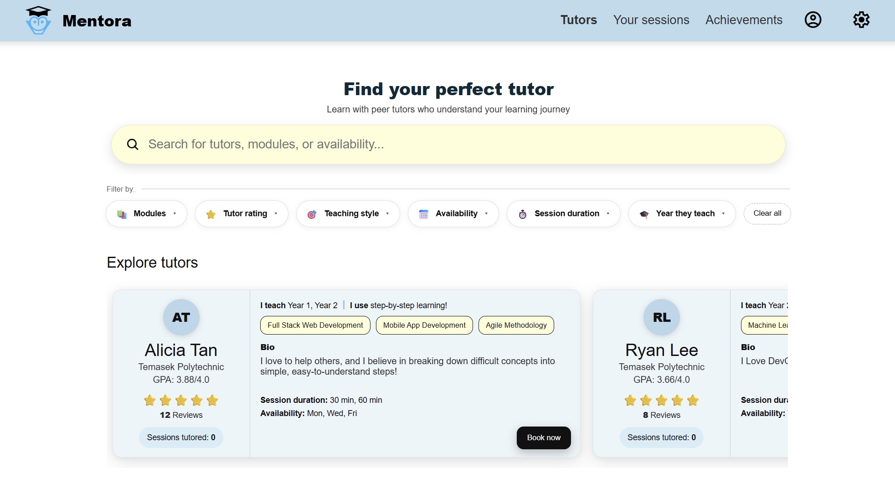

  

A peer-to-peer tutoring web application designed to improve tutor discovery, lesson organisation, and accountability between tutors and tutees.

---

# 📚 Problems Identified

## 1️⃣ Unstructured Tutor Discovery
Students struggle to find suitable, credible, and available peer tutors due to scattered information and informal communication channels.

## 2️⃣ Disorganised Peer Tutoring Sessions
Tutors and tutees face scheduling conflicts, unclear lesson expectations, and unprepared sessions due to poor coordination tools.

## 3️⃣ Low Accountability & Frequent No-Shows
Last-minute cancellations and missed sessions reduce tutor motivation and create unreliable learning experiences.

---

# 🛠 Tech Stack

---

# 💻 Technologies & Libraries Used

### Frontend
- React.js
- Custom CSS

### Backend
- Node.js
- Express.js
- MongoDB Atlas
- Mongoose

### Additional Features
- Role-based Authentication
- RESTful APIs
- Gamification System
- Attendance Tracking
- Ratings & Reviews
- Search & Filtering

---

# 🖼 Application Preview

  

---

# ✨ Core Features

## 👤 Role-Based Accounts
- Tutor and tutee registration/login
- Editable profile management
- Structured tutor profiles with teaching details

## 🔍 Tutor Search & Filtering
- Search tutors by modules, rating, teaching style, availability, and year level
- Dynamic filtering for faster tutor discovery

## ⭐ Ratings & Reviews
- Session ratings and written reviews
- Tutor credibility indicators and average ratings

## 📅 Interactive Scheduling System
- Tutor availability calendar
- Time slot booking system
- Organised session scheduling

## 📝 Pre-Session Lesson Planning
- Tutees submit lesson objectives and questions before sessions

## 📂 Session Management Tabs
- Organised tabs for upcoming sessions, pending requests, and history
- Prevents messy and confusing schedules

## 📖 Post-Session Progress Logs
- Tutees reflect on learning progress after sessions
- Helps maintain lesson continuity

## 📍 Attendance Confirmation
- Tutors and tutees confirm attendance before sessions
- Reduces no-shows and forgotten lessons

## 🏆 Gamification & Achievements
- Badges, achievements, points, and reliability streaks
- Encourages accountability and consistent participation

## ⚠ Fair Cancellation System
- Tracks missed sessions and attendance rates

---

# 💡 Solution Overview

Mentora is a full-stack peer tutoring platform that improves how students discover tutors, organise lessons, and maintain accountability.

The platform helps students:
- Find suitable and credible tutors quickly
- Organise tutoring sessions efficiently
- Improve lesson preparation and communication
- Encourage reliable attendance and commitment

Mentora also supports tutors by:
- Reducing last-minute cancellations
- Increasing motivation through recognition systems
- Providing structured teaching workflows
- Building trust through transparent tutor profiles and reviews

---

# 🏅 Gamification System

Mentora includes a gamification system designed to encourage consistent participation and responsible behaviour.

Features include:
- Achievement badges
- Reliability streaks
- Attendance tracking
- Points rewards
- Progress bars for upcoming achievements
- Leaderboard-ready architecture

---

# 📈 Impact & Goals

Mentora aims to:
- Improve accessibility to peer tutoring
- Reduce disorganised learning experiences
- Encourage accountability between tutors and tutees
- Increase tutor motivation and retention
- Create a more supportive peer-learning ecosystem

By combining structured scheduling, transparent tutor credibility, and gamification, Mentora creates a more reliable and engaging peer tutoring experience.